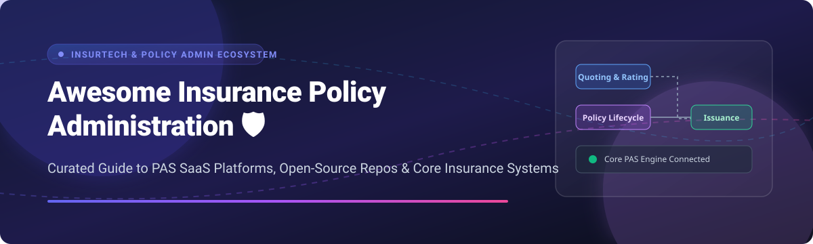

# 🛡️ Awesome Insurance Policy Administration 🚀

  

  
  
  
  
  

---

## 📌 Top Insurance Policy Administration Platforms & Open-Source Ecosystem 💼

**Curated Guide to Policy Lifecycle Management, Quoting, Issuance, Endorsements, Rating Engines, Renewals & Core InsurTech Infrastructure** ⚡

*Last updated: September 2026* 🗓️

This repository tracks notable **SaaS enterprise platforms** and **open-source GitHub projects** for **Insurance Policy Administration Systems (PAS)**. These software solutions automate and manage the complete policy lifecycle—including quoting, rating, underwriting workflows, issuance, endorsements, renewals, billing, and cancellations—across P&C (Property & Casualty), Life, Health, and Specialty commercial insurance lines. 🏢

---

## 📑 Table of Contents
- [📊 SaaS & Enterprise Hosted Platforms](#-saas--enterprise-hosted-platforms)
- [🔓 Open-Source GitHub Projects](#-open-source-github-projects)
- [🛠️ How to Contribute](#️-how-to-contribute)
- [🤝 Support & Community](#-support--community)
- [⚠️ Disclaimer](#️-disclaimer)
- [📈 Star History](#-star-history)

---

## 📊 SaaS & Enterprise Hosted Platforms

> 💡 **Sector Market Size & Dynamics:** The global Insurance Policy Administration Systems (PAS) market is estimated at **$10.5 Billion - $13.8 Billion** (projected to exceed $20B+ by 2030 at ~11.5% CAGR). The market is **moderately fragmented**—dominated by top tier-1 enterprise platforms (Guidewire, Duck Creek) at the high-end carrier level, alongside an expanding ecosystem of API-first InsurTech platforms (Socotra, BriteCore) serving MGAs and mid-market carriers. 📈

| Platform / Vendor | Description | Pricing Model & Starting Tier | Free Tier / Trial Limit | Valuation / Revenue Scale |
| :--- | :--- | :--- | :--- | :--- |
| 🏢 **[Guidewire PolicyCenter](https://www.guidewire.com/)** | Dominant P&C policy administration suite for enterprise carriers covering quote, bind, issue, endorse, renew, and cancel across multi-line operations. | Quote-based enterprise license (Starts ~$100,000+/yr for mid-tier deployment) | ❌ No free tier (Demo / sandbox upon sales request) | 💰 **$1.237B ARR** (NYSE: GWRE / ~$8.5B Market Cap) |
| 🦆 **[Duck Creek Policy](https://www.duckcreek.com/)** | Cloud-native policy administration platform with low-code configuration for rating, coverage structures, and endorsement workflows. | Enterprise SaaS subscription (Starts ~$75,000+/yr based on Direct Written Premium) | ❌ No free tier (Private guided demo only) | 💰 **$380M+ ARR** (Acquired by Vista Equity for ~$2.6B) |
| 🏛️ **[Sapiens CoreSuite Policy](https://www.sapiens.com/)** | Comprehensive core insurance software delivering multi-line policy administration across global markets and distribution models. | Custom annual enterprise subscription (Starts ~$60,000+/yr) | ❌ No free tier (Request-based sandbox demo) | 💰 **$520M+ Revenue** (NASDAQ: SPNS / ~$1.8B Market Cap) |
| 🛡️ **[Insurity Policy Decisions](https://www.insurity.com/)** | Policy administration and decisioning platform for P&C insurers, supporting rating, underwriting, and policy lifecycle workflows. | Enterprise SaaS subscription (Starts ~$50,000+/yr) | ❌ No free tier (Sales demo available) | 💰 **$300M+ Estimated Revenue** (Private Equity backed) |
| ⚡ **[Majesco Policy](https://www.majesco.com/)** | Policy administration capabilities within Majesco’s cloud core suite for P&C, L&A, and specialty insurance carriers. | Enterprise license & cloud subscription (Starts ~$50,000+/yr) | ❌ No free tier (Sales demo available) | 💰 **$250M+ Estimated Revenue** (Acquired by Thoma Bravo) |
| 🌐 **[EIS Suite](https://www.eisgroup.com/)** | Core digital insurance platform providing policy administration, product definition, and high-velocity multi-line support. | Custom tier-1 enterprise pricing (Starts ~$60,000+/yr) | ❌ No free tier (Demo on request) | 💰 **$150M+ Estimated Revenue** |
| 🇳🇱 **[Keylane](https://www.keylane.com/)** | Policy administration and core insurance management systems focused on European P&C and Life/Pension markets. | Enterprise subscription (Starts ~$40,000+/yr) | ❌ No free tier (Sales demonstration) | 💰 **$120M+ Estimated Revenue** |
| 🔌 **[Socotra](https://www.socotra.com/)** | API-first, cloud-native policy administration platform built for modern InsurTechs, embedded products, and rapid carrier configuration. | Usage & subscription based (Starts ~$2,500/mo or $30,000/yr) | ❌ No free tier (Guided interactive demo) | 💰 **$25.6M Revenue** (Raised $94M total funding) |
| ⚙️ **[OneShield Policy](https://www.oneshield.com/)** | Highly configurable policy administration system supporting complex product definitions, rating, and policy lifecycle management. | Enterprise license/SaaS (Starts ~$40,000+/yr) | ❌ No free tier (Sales demo available) | 💰 **$80M+ Estimated Revenue** |
| 🌩️ **[BriteCore](https://www.britecore.com/)** | Cloud-native P&C policy administration suite built for small-to-midsize insurers and MGAs seeking an all-in-one platform. | Annual subscription (Starts ~$20,000 - $35,000/yr base) | ❌ No free tier (Demo environment upon request) | 💰 **$30M+ Estimated Revenue** (Raised $60M+ funding) |

---

## 🔓 Open-Source GitHub Projects

> 💡 **Open-Source Note:** Full enterprise policy administration systems (PAS) handle heavy regulatory compliance and complex rating algorithms. The projects below represent the best available open-source core frameworks, reference architectures, rating libraries, and policy management modules for developers building custom InsurTech solutions. ⚡

| Repository & Link 🔗 | Star Count 🌟 | Description 📝 | Key Features 🗝️ |
| :--- | :--- | :--- | :--- |
| 🏛️ **[aposin/openinsuranceplatform](https://github.com/aposin/openinsuranceplatform)** |  | Comprehensive open-source core insurance platform covering policy contracts, claims, billing, and commissions. | Party management, policy contract lifecycle, claims settlement, commission distribution engine. |
| 🚗 **[open-insurance/auto-insurance-policy-admin](https://github.com/open-insurance/auto-insurance-policy-admin)** |  | Modern open-source auto policy administration and quoting engine built with Node.js & React. | Quote calculation, auto policy generation, endorsement portal, API-first architecture. |
| 🛡️ **[daxaxelrod/open_insure](https://github.com/daxaxelrod/open_insure)** |  | Open-source policy & claims software for group, mutual, and self-insurance models. | Policy pool creation, coverage types management, transparent claim settlement workflows. |
| 📋 **[insurtech-lab/policy-engine](https://github.com/insurtech-lab/policy-engine)** |  | Open-source rating rules engine and product definition framework for policy quoting. | Rule-based premium calculation, product schema builder, underwriting gatekeeping. |
| 💼 **[open-insurtech/insurance-crm-core](https://github.com/open-insurtech/insurance-crm-core)** |  | Open CRM engine tailored for insurance broker policy tracking and customer management. | Policy renewal tracking, agent POS interface, payment tracking, customer timeline. |
| 🐳 **[insurtech-docker/pas-sandbox](https://github.com/insurtech-docker/pas-sandbox)** |  | Dockerized reference architecture and developer sandbox for testing policy admin microservices. | Containerized policy core, REST API mocks, sample database seeders, developer dashboard. |

---

## 🛠️ How to Contribute

Contributions are warmly welcomed! Help keep this InsurTech resource updated and comprehensive. 🌟

1. 🍴 **Fork the repository**
2. 📝 **Add or edit entries** in `README.md` following the tabular format
3. 🔍 **Verify details**: Include platform name, official link, precise descriptions, pricing details, and star badges
4. 🚀 **Submit a Pull Request** with a brief summary of your changes

---

## 🤝 Support & Community

If you find this repository helpful, please consider supporting the project:
* ⭐ **Star** this repository to show your appreciation
* 🔀 **Fork** it to keep a copy and contribute back
* 📢 **Share** it with fellow developers, InsurTech engineers, and insurance technology teams!

☕ **Sponsor & Buy me a coffee:**
If you'd like to support ongoing open-source curation and development, check out my [GitHub Sponsor Dashboard](https://github.com/sponsors/ishandutta2007)! 💖

---

## ⚠️ Disclaimer

* This is a **community-curated list** for informational and research purposes.
* Policy administration software manages legally binding insurance contracts and sensitive personal customer data. Any open-source component or enterprise software deployment requires strict security audits, regulatory compliance, data privacy protection (GDPR, HIPAA, etc.), and legal governance.

---

## 📈 Star History

---

  <i>Made with ❤️ for insurance carriers, MGAs, brokers, and InsurTech teams modernizing core policy administration.</i>

